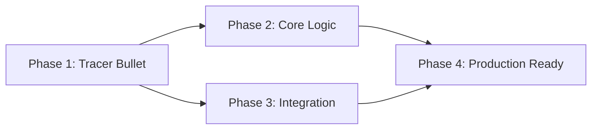

# 总体计划文档模板

> 此文档为 plan skill 的 L3 参考文档，在 SKILL.md Step 4 中按需加载。
> 定义了宏观总体计划的文档结构，用于跨阶段跟踪。

---

## 文档结构

总体计划关注"做什么阶段"而非"怎么做"。默认极简，只保留阶段划分、依赖和放行信息；执行状态、实验记录、过程性结论不应混入正文。

---

```markdown
# 总体计划 — <功能名称>

> 版本：v1.0
> 创建时间：<YYYY-MM-DD HH:MM>
> 关联需求文档：`docs/requirements/<feature-slug>.md`
> 关联澄清记录：`docs/requirements/<feature-slug>-clarification.md`

## 0. 理解辅助（可选）

当项目跨多个系统边界、角色或异步链路时，可在开头给出一个简短流程图 / 时序图帮助建立整体心智模型；否则省略。


```mermaid
flowchart LR
  U[用户/入口] --> S1[系统 A]
  S1 --> S2[系统 B]
  S2 --> O[输出]
```

## 1. 项目概述

### 1.1 目标
<一句话描述整个项目的目标>

### 1.0 第一性原理定义
- **最小用户价值 / 系统价值**：<项目最终成立后最小能带来什么>
- **必要成立条件**：
  - <条件1>
  - <条件2>
- **优先验证的高风险假设**：<如无则写“无”>

### 1.2 成功标准
- [ ] <项目级成功标准 1>
- [ ] <项目级成功标准 2>

### 1.3 范围
- **范围内**：<高层级范围内事项>
- **范围外**：<明确不做的事项>

## 2. 阶段划分

<!-- 
  按垂直切片原则，每个阶段交付一个可独立验证的增量。
  Tracer Bullet（Phase 1）：最简端到端流程。
-->

### Phase 1: <阶段名称> — <阶段目标一句话>

| 属性 | 值 |
|------|-----|
| **目标** | <此阶段要达成的可交付成果> |
| **依赖** | None |

**宏观任务**：
- [ ] <可选：最小可行性验证 / tracer bullet / spike gate>
- [ ] <宏观任务1：动词+成果>
- [ ] <宏观任务2>
- [ ] <宏观任务3>

**完成标准**：
- [ ] <此阶段完成时用户/系统能做什么>

**详细计划**：`docs/requirements/<slug>-detailed-plan-p1.md`

---

### Phase 2: <阶段名称> — <阶段目标一句话>

| 属性 | 值 |
|------|-----|
| **目标** | <此阶段要达成的可交付成果> |
| **依赖** | Phase 1 完成 |

**宏观任务**：
- [ ] <宏观任务1>
- [ ] <宏观任务2>

**完成标准**：
- [ ] <此阶段完成时用户/系统能做什么>

**详细计划**：`docs/requirements/<slug>-detailed-plan-p2.md`

---

### Phase 3: <阶段名称> — <阶段目标一句话>

<同上结构>

---

## 3. 阶段依赖关系


```mermaid
graph LR
  P1[Phase 1: Tracer Bullet] --> P2[Phase 2: Core Logic]
  P1 --> P3[Phase 3: Integration]
  P2 --> P4[Phase 4: Production Ready]
  P3 --> P4
```

## 4. 里程碑（可选）

- [ ] <里程碑1：核心流程可跑>
- [ ] <里程碑2：主要用例完成>
- [ ] <里程碑3：集成测试通过>
- [ ] <里程碑4：生产上线>

## 5. 资源与风险（可选）

### 5.1 关键依赖
| 依赖项 | 类型（外部/内部/技术） | 状态 | 风险 |
|--------|----------------------|------|------|
| <依赖1> | 外部 | 已确认 | 低 |
| <依赖2> | 技术 | 待确认 | 高 |

### 5.2 主要风险
| 风险 | 影响(H/M/L) | 概率(H/M/L) | 缓解措施 |
|------|------------|------------|---------|
| <风险1> | H | M | <措施> |
| <风险2> | M | L | <措施> |

## 6. 变更记录（可选）

| 日期 | 版本 | 变更内容 | 原因 |
|------|------|---------|------|
| <date> | v1.0 | 初始版本 | — |
| <date> | v1.1 | Phase 2 增加一个宏观任务 | 需求澄清发现遗漏 |

## 阶段划分原则

### Tracer Bullet（Phase 1）

第一个阶段应该是**最薄的端到端切片**：

- 覆盖所有技术层（入口 → 业务逻辑 → 数据层 → 输出）
- 只实现最核心的一个场景（Happy Path）
- 不做错误处理优化（仅最基本的校验）
- 不做性能优化
- 目标：让用户/开发者能"看到东西在跑"

### 最小可行性验证（可选）

只有在存在高风险假设时才加入，常见触发条件：
- 外部依赖、第三方系统、真实数据源、权限或部署环境未验证
- 技术路线存在较高不确定性
- 错误假设会造成明显返工

验证任务必须满足：
- 只验证单个关键假设
- 有明确成功/失败标准
- 输出明确 gate：继续、降级、切换方案或停止

### 后续阶段

- **Phase 2**：补充核心业务逻辑、错误处理、输入校验
- **Phase 3**：边界情况、外部集成、异步处理、并发
- **Phase N（最后）**：生产化——监控、文档、回滚方案、性能调优

### 何时不需要总体计划

以下情况优先走 Fast Path，直接生成简化计划，而不是进入总体计划：
- 需求只涉及单文件修改
- 纯配置变更
- 简单 Bug 修复
- 预估总任务数 ≤ 3 个
- 用户明确表示"改动很小，不需要总体计划"

### 阶段数量建议

| 需求规模 | 建议阶段数 | 每阶段任务数 |
|----------|-----------|------------|
| 小型（<5 个任务） | 1 个阶段 | 1-5 |
| 中型（5-15 个任务） | 2-3 个阶段 | 3-5 |
| 大型（15+ 个任务） | 3-5 个阶段 | 3-5（复杂阶段可放宽到 6-7） |

---

## 使用说明

此模板在 SKILL.md Step 4 中被加载。Claude 应：

1. 读取此模板了解总体计划的结构
2. 基于需求文档评估改动规模
3. 小改动 → 不使用此模板，改走 Fast Path 生成 `docs/requirements/<slug>-micro-plan.md`
4. 中大型改动 → 按模板划分阶段，创建总体计划文档
5. 将各阶段的宏观任务直接写入总体计划文档中的 checkbox 列表，作为默认进度事实源
6. 总体计划文档存储在 `docs/requirements/<slug>-overall-plan.md`
