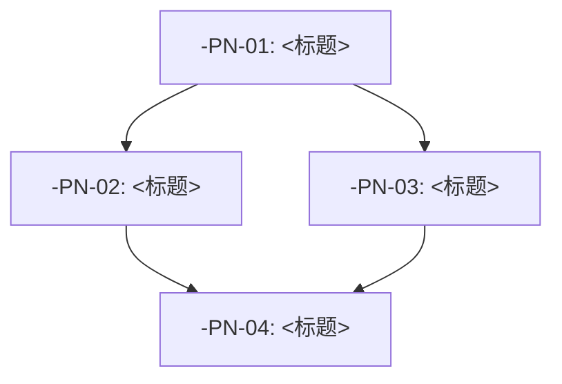

# 详细计划文档模板

> 此文档为 plan skill 的 L3 参考文档，在 SKILL.md Step 4 中按需加载。
> 定义了单个阶段（Phase）的详细实施计划文档结构。

---

## 文档结构

每个详细计划文档应包含以下章节。章节标注"（可选）"的可在不适用时省略。

---

```markdown
# 详细计划 — <功能名称> — Phase <N>: <阶段名称>

> 版本：v1.0
> 创建时间：<YYYY-MM-DD HH:MM>
> 关联需求文档：`docs/requirements/<feature-slug>.md`
> 关联总体计划：`docs/requirements/<feature-slug>-overall-plan.md`
> 关联澄清记录：`docs/requirements/<feature-slug>-clarification.md`

## 1. 阶段目标

<一句话描述此阶段要达成的可交付成果>

### 1.1 成功标准
- [ ] <可验证的阶段级成功标准 1>
- [ ] <可验证的阶段级成功标准 2>
- [ ] <可验证的阶段级成功标准 3>

### 1.2 垂直切片描述
此阶段覆盖的端到端流程：
```
<入口> → <中间层> → <数据层> → <输出>
```

## 2. 架构约束

从项目架构文档（architecture.md / CLAUDE.md）中提取的约束：

| 约束类型 | 约束内容 | 来源 |
|----------|---------|------|
| 目录结构 | <例如：业务逻辑放在 services/ 下> | architecture.md |
| 命名规范 | <例如：文件名使用 kebab-case> | CLAUDE.md |
| 技术栈 | <例如：必须使用 Express + TypeScript> | architecture.md |
| 测试要求 | <例如：核心逻辑需单元测试覆盖> | CLAUDE.md |

### 2.1 需遵守的现有模式
- **错误处理**：<参考哪个模块的错误处理模式>
- **日志规范**：<参考哪个模块的日志格式>
- **API 设计**：<参考哪个模块的 API 风格>

## 3. 任务列表

<!-- 
  任务 ID 格式：<SLUG>-P<phase>-<seq>
  SLUG 为功能缩写（如 LOGIN, UPLOAD, DASHBOARD）
  规模：S(1-2文件) / M(3-5文件) / L(5+文件，需进一步拆分)
-->

### <SLUG>-PN-01: <任务标题动词+成果>

- **描述**：<一段话描述任务要完成什么，包括关键逻辑>
- **验收标准**：
  - [ ] <Given/When/Then 或可验证条件 1>
  - [ ] <可验证条件 2>
- **验证方式**：
  ```
  <测试命令或手动验证步骤>
  ```
- **依赖**：None（或列出前置任务 ID）
- **涉及文件**（预估）：
  | 文件路径 | 操作 | 说明 |
  |----------|------|------|
  | `<path/to/file1>` | 新增 | <改动说明> |
  | `<path/to/file2>` | 修改 | <改动说明> |
- **规模**：S / M / L
- **逻辑概要**（伪代码）：
  ```
  // 描述核心逻辑即可，不涉及具体实现细节
  // 关注：数据流、判断分支、异常路径
  
  function handleXxx(input):
    // 1. 校验输入
    if not valid(input):
      return error("invalid input", 400)
    
    // 2. 核心处理
    result = process(input)
    
    // 3. 持久化
    save(result)
    
    // 4. 返回
    return {ok: true, data: result}
  ```

---

### <SLUG>-PN-02: <任务标题>

<同上结构>

---

## 4. 依赖关系图



或简化为文本：
```
<SLUG>-PN-01 (无依赖)
  ├──→ <SLUG>-PN-02 (依赖 PN-01)
  ├──→ <SLUG>-PN-03 (依赖 PN-01)
  └──→ <SLUG>-PN-04 (依赖 PN-02 + PN-03)
```

## 5. 检查点

在完成特定任务后，设置检查点以验证进展：

| 检查点 | 触发条件 | 验证内容 |
|--------|---------|---------|
| Checkpoint A | 完成 PN-02 后 | 核心端到端流程可运行 |
| Checkpoint B | 完成 PN-04 后 | 验收标准全部通过 |

## 6. 测试策略

### 6.1 单元测试
- **覆盖范围**：<哪些模块/函数需要单元测试>
- **关键场景**：
  - <场景1：正常输入>
  - <场景2：边界值>
  - <场景3：异常输入>

### 6.2 集成测试（可选）
- **覆盖范围**：<需要集成测试的模块间交互>
- **测试数据**：<测试数据准备方式>

### 6.3 手工验证（可选）
1. <步骤1：启动应用>
2. <步骤2：触发目标功能>
3. <步骤3：检查输出/数据库/日志>
4. <步骤4：验证边缘情况>

## 7. 风险与缓解

| 风险 | 影响(H/M/L) | 概率(H/M/L) | 缓解措施 |
|------|------------|------------|---------|
| <风险描述1> | M | L | <如何缓解> |
| <风险描述2> | H | M | <如何缓解> |

## 8. 不在本阶段的范围

明确列出此阶段不做的事项（防止范围蔓延）：
- <推迟到下阶段的事项1>
- <推迟到下阶段的事项2>
- <明确不做的事项>

## 9. 开放问题

需要用户或团队确认才能推进的事项：
- [ ] <问题1> — 负责人：<who>，截止：<when>
- [ ] <问题2> — 负责人：<who>，截止：<when>

---

## 附录 A：任务规模参考

| 规模 | 文件数 | 典型耗时 | 示例 |
|------|--------|---------|------|
| XS | 1 | <1h | 新增单个函数、修改配置 |
| S | 1-2 | 1-3h | 新增一个组件/端点 |
| M | 3-5 | 3h-1d | 一个完整功能切片 |
| L | 5-8 | 1-2d | 多组件功能，考虑拆分 |
| XL | 8+ | 2d+ | 必须进一步拆分 |

## 附录 B：伪代码规范

伪代码应描述逻辑而非实现，聚焦于：
- **数据流**：输入 → 处理 → 输出 的路径
- **判断分支**：什么条件下走什么路径
- **异常路径**：出错时如何处理
- **不写**：具体 API 调用、数据库查询、框架细节

```python
# 好的伪代码（聚焦逻辑）
function handleLogin(credentials):
  if not validateFormat(credentials):
    return error(400, "invalid format")
  
  user = findUser(credentials.identifier)
  if not user:
    return error(401, "user not found")
  
  if not verifyPassword(credentials.password, user.hash):
    logFailedAttempt(credentials.identifier)
    return error(401, "wrong password")
  
  session = createSession(user.id)
  return success({token: session.token, user: sanitizeUser(user)})

# 不好的伪代码（过于具体）
function handleLogin(req, res):
  const { email, password } = req.body
  if (!email || !password) return res.status(400).json(...)
  const user = await UserModel.findOne({ email }).select('+password')
  if (!user) return res.status(401).json(...)
  const isMatch = await bcrypt.compare(password, user.password)
  ...
```
```

---

## 使用说明

此模板在 SKILL.md Step 4 中被加载。Claude 应：

1. 读取此模板了解详细计划的结构
2. 基于用户的架构约束文档（architecture.md / CLAUDE.md）填充第 2 章
3. 基于需求文档和总体计划填充第 3 章（任务列表）
4. 为每个任务生成 TODO（使用 TaskCreate）
5. 任务数量控制在 3-7 个/阶段，过少可合并阶段，过多需进一步拆分
