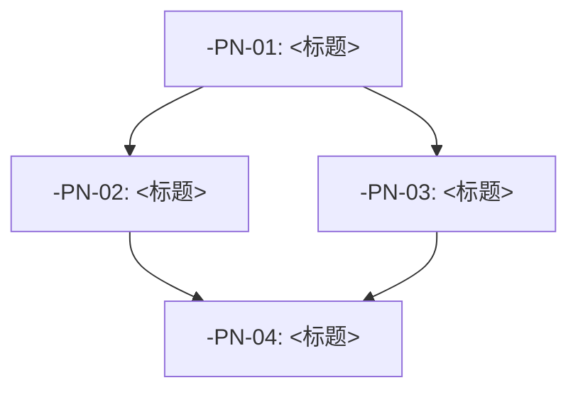

# 详细计划文档模板

> 此文档为 plan skill 的 L3 参考文档，在 SKILL.md Step 5 中按需加载。
> 定义了单个阶段（Phase）的详细实施计划文档结构。

---

## 文档结构

每个详细计划文档应遵循“默认极简，按需展开”。除核心章节外，其余内容仅在确有信息价值时保留。

---

```markdown
# 详细计划 — <功能名称> — Phase <N>: <阶段名称>

> 版本：v1.0
> 创建时间：<YYYY-MM-DD HH:MM>
> 关联需求文档：`docs/requirements/<feature-slug>.md`
> 关联总体计划：`docs/requirements/<feature-slug>-overall-plan.md`
> 关联澄清记录：`docs/requirements/<feature-slug>-clarification.md`

## 0. 理解辅助（可选）

当阶段横跨多个系统边界、异步链路或数据流较复杂时，可在文档开头提供一个**简短**流程图 / 时序图帮助理解；否则省略。


```mermaid
flowchart LR
  A[入口] --> B[关键处理]
  B --> C[中间态]
  C --> D[输出]
```

## 1. 阶段目标

<一句话描述此阶段要达成的可交付成果>

### 1.0 第一性原理定义
- **最小可交付成果**：<本阶段完成后，用户/系统最小能获得什么新能力>
- **必要成立条件**：
  - <条件1>
  - <条件2>
- **非独立成果**：<哪些只是实现展开，不应单独拆成任务>

### 1.1 成功标准
- [ ] <可验证的阶段级成功标准 1>
- [ ] <可验证的阶段级成功标准 2>
- [ ] <可验证的阶段级成功标准 3>

### 1.2 垂直切片描述
此阶段覆盖的端到端流程：
```
<入口> → <中间层> → <数据层> → <输出>
```

## 2. 架构约束

从项目架构文档（architecture.md / CLAUDE.md）中提取的约束：

| 约束类型 | 约束内容 | 来源 |
|----------|---------|------|
| 目录结构 | <例如：业务逻辑放在 services/ 下> | architecture.md |
| 命名规范 | <例如：文件名使用 kebab-case> | CLAUDE.md |
| 技术栈 | <例如：必须使用 Express + TypeScript> | architecture.md |
| 测试要求 | <例如：核心逻辑需单元测试覆盖> | CLAUDE.md |

### 2.1 需遵守的现有模式
- **错误处理**：<参考哪个模块的错误处理模式>
- **日志规范**：<参考哪个模块的日志格式>
- **API 设计**：<参考哪个模块的 API 风格>

## 3. 任务列表

<!-- 
  任务 ID 格式：<SLUG>-P<phase>-<seq>
  SLUG 为功能缩写（如 LOGIN, UPLOAD, DASHBOARD）
  规模：S(1-2文件) / M(3-5文件) / L(5+文件，需进一步拆分)
  默认目标：3-5 个任务/阶段。不要为了凑数量而拆分。
  同一条最小交付链路默认合并；只有能独立验收、独立派发、独立失败恢复时才拆开。
-->

### <SLUG>-PN-00: 最小可行性验证（可选）

- [ ] **任务**：<SLUG>-PN-00 最小可行性验证
- **何时加入**：仅当存在高风险假设，例如外部依赖未验证、真实数据未知、权限/环境不确定、技术路线可能失败
- **描述**：<要验证的单个关键假设>
- **成功标准**：
  - [ ] <验证通过的明确条件>
- **失败后的决策**：
  - <继续 / 降级 / 切换方案 / 延期>
- **验证方式**：
  ```
  <最小实验命令或步骤>
  ```
- **依赖**：None（或列出前置任务 ID）

### <SLUG>-PN-01: <任务标题动词+成果>

- [ ] **任务**：<SLUG>-PN-01 <任务标题动词+成果>
- **描述**：<一段话描述任务要完成什么，包括关键逻辑>
- **验收标准**：
  - [ ] <Given/When/Then 或可验证条件 1>
  - [ ] <可验证条件 2>
- **目录/模块结构**（可选，见下方触发表）：
  ```
  <新建或调整的目录/模块落点，对齐现有分层；不写完整树>
  ```
- **数据结构**（可选，见下方触发表）：
  ```
  <关键类型 / 字段 / 状态枚举；不写样板 DTO>
  ```
- **接口契约**（可选，见下方触发表）：
  ```
  <输入 / 输出 / 错误码，或函数签名级约定>
  ```
- **逻辑概要**（可选，见下方触发表）：
  ```
  <只描述高价值逻辑，不写样板 CRUD>
  ```
- **涉及文件**（可选，见下方触发表）：
  | 文件路径 | 操作 | 说明 |
  |----------|------|------|
  | `<path/to/file1>` | 新增 | <改动说明> |
  | `<path/to/file2>` | 修改 | <改动说明> |
- **验证方式**（可选，见下方触发表）：
  ```
  <一条可执行命令，或 2-3 步手工检查>
  ```
- **不做**（可选，见下方触发表）：
  - <本任务明确不碰的点 1>
  - <本任务明确不碰的点 2>
- **依赖**：None（或列出前置任务 ID）

---

### <SLUG>-PN-02: <任务标题>

<同上结构；简单任务可只保留任务 / 描述 / 验收标准 / 依赖>

---

### 任务级可选字段触发表

必填仅三项：`任务`、`描述`、`验收标准`。其余字段**只有命中触发条件才写**；写了就要短，宁缺毋滥。

| 可选字段 | 何时写 |
|----------|--------|
| **目录/模块结构** | 新建模块 / 跨层改动 / 目录约定不直观 |
| **数据结构** | 引入新实体、状态机状态、持久化 schema、跨任务共享类型 |
| **接口契约** | 任务产出会被后续任务消费，或对外暴露 API / CLI / 事件 |
| **逻辑概要** | 状态机 / 调度 / 去重 / 冲突 / 权限分支 / 重试补偿 |
| **涉及文件** | 边界复杂、并行派发需锁文件、或高风险改动 |
| **验证方式** | 验收标准无法靠读代码一眼判定时 |
| **不做** | 容易越界改相邻模块，或与下阶段有明确分界时 |

原则：能显著降低实施歧义才写；不为模板完整性强行填满。

## 4. 依赖关系


```mermaid
graph TD
  T01[<SLUG>-PN-01: <标题>] --> T02[<SLUG>-PN-02: <标题>]
  T01 --> T03[<SLUG>-PN-03: <标题>]
  T02 --> T04[<SLUG>-PN-04: <标题>]
  T03 --> T04
```

或简化为文本：
```
<SLUG>-PN-01 (无依赖)
  ├──→ <SLUG>-PN-02 (依赖 PN-01)
  ├──→ <SLUG>-PN-03 (依赖 PN-01)
  └──→ <SLUG>-PN-04 (依赖 PN-02 + PN-03)
```

## 5. 放行检查点（可选）

如果阶段需要一个明确 gate，可保留 1 个最终放行检查点；若任务验收标准已足够覆盖，可省略本章。

- [ ] **Final Gate**：关键任务完成，且阶段级成功标准全部通过

## 6. 测试策略（可选）

若任务级验证方式已经足够清晰，本章可精简到只列关键测试面，不必展开成大段重复内容。

### 6.1 单元测试
- **覆盖范围**：<哪些模块/函数需要单元测试>
- [ ] <场景1：正常输入>
- [ ] <场景2：边界值>
- [ ] <场景3：异常输入>

### 6.2 集成测试（可选）
- **覆盖范围**：<需要集成测试的模块间交互>
- [ ] <集成场景1>
- [ ] <集成场景2>
- **测试数据**：<测试数据准备方式>

### 6.3 手工验证（可选）
- [ ] <步骤1：启动应用>
- [ ] <步骤2：触发目标功能>
- [ ] <步骤3：检查输出/数据库/日志>
- [ ] <步骤4：验证边缘情况>

## 7. 风险与缓解

仅在存在真实高风险项时保留；否则省略。

| 风险 | 影响(H/M/L) | 概率(H/M/L) | 缓解措施 |
|------|------------|------------|---------|
| <风险描述1> | M | L | <如何缓解> |
| <风险描述2> | H | M | <如何缓解> |

## 8. 不在本阶段的范围

明确列出此阶段不做的事项（防止范围蔓延）：
- <推迟到下阶段的事项1>
- <推迟到下阶段的事项2>
- <明确不做的事项>

## 9. 开放问题（可选）

仅在确有待确认事项时保留；否则省略。

需要用户或团队确认才能推进的事项：
- [ ] <问题1> — 负责人：<who>，截止：<when>
- [ ] <问题2> — 负责人：<who>，截止：<when>

## 使用说明

此模板在 SKILL.md Step 5 中被加载。Claude 应：

1. 读取此模板了解详细计划的结构
2. 基于用户的架构约束文档（architecture.md / CLAUDE.md）填充第 2 章
3. 基于需求文档和总体计划填充第 3 章（任务列表）
4. 将每个任务直接写入详细计划文档中的 checkbox 列表，作为默认进度事实源
5. 先写“第一性原理定义”，再生成任务列表
6. 任务数量默认控制在 3-5 个/阶段；只有复杂阶段才放宽到 6-7 个
7. 高风险假设存在时才加入“最小可行性验证”任务
8. 任务级可选字段（目录/模块结构、数据结构、接口契约、逻辑概要、涉及文件、验证方式、不做）严格按触发表展开；图示、风险、开放问题同样按需输出，不要为了模板完整性强行填写
9. 简单任务可只保留任务 / 描述 / 验收标准 / 依赖；复杂任务至少补齐命中触发条件的 1-2 个可选字段
10. 任务、验收标准、测试场景、人工验证步骤统一使用 todo list；后续修改和进度展示都基于勾选状态
11. 不单独写显式进度百分比或阶段内进度描述；进度通过 checkbox 勾选状态间接体现
