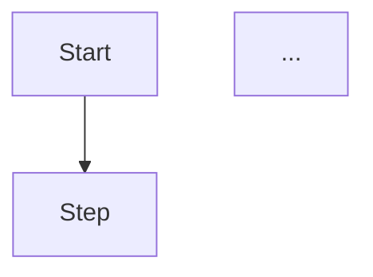

# PR Skill

## Overview

You will help users create a pull request (or merge request) from the current branch. Core principle: **detect first, draft second, submit last**. Never push a PR before the user reviews the draft.

This skill follows the **progressive knowledge** pattern defined in `docs/architecture.md`:
- Determine the repo type (L1 — automatic from remote URL)
- Load the matching CLI reference (L2 — gh/glab/tea usage guide)
- Draft and submit (L3 — user confirmation gates each step)

## Workflow

### Step 1: Detect Repository Type

Run `git remote get-url origin` and classify the hosting platform:

| Remote URL Pattern | Platform | CLI Tool |
|--------------------|----------|----------|
| `github.com` | GitHub | `gh` |
| `gitlab.com` or contains `gitlab` | GitLab | `glab` |
| `gitea.com` or contains `gitea` | Gitea | `tea` |

Also check which git hosting CLIs are currently available:

```bash
which gh 2>/dev/null && echo "gh: OK" || echo "gh: MISSING"
which glab 2>/dev/null && echo "glab: OK" || echo "glab: MISSING"
which tea 2>/dev/null && echo "tea: OK" || echo "tea: MISSING"
```

If the required CLI is **not installed**, inform the user with install instructions and stop:

```
The remote <url> is hosted on <Platform>. The <cli> CLI is required but not installed.

Install it with:
  - GitHub: brew install gh (macOS) / apt install gh (Linux) / winget install GitHub.cli (Windows)
  - GitLab: brew install glab (macOS) / apt install glab (Linux) / winget install GitLab.glab (Windows)
  - Gitea: brew install tea (macOS) / apt install tea (Linux)

After installing, authenticate:
  - GitHub: gh auth login
  - GitLab: glab auth login
  - Gitea: tea login add

Then run this skill again.
```

If the CLI is available but not authenticated, ask the user to authenticate first (e.g., `gh auth login`), then retry.

If no remote is configured (`git remote get-url origin` fails), tell the user:

```
No remote "origin" is configured. Please push your branch to a remote first, then run this skill again.
```

### Step 2: Determine PR Scope

Collect the information needed to build the PR:

1. **Base branch** — the target branch to merge into. Infer from context:
   - Check `git remote show origin` for the default branch (usually `main` or `master`)
   - Or ask the user: "Which branch should this PR target? (default: main)"

2. **HEAD branch** — the current branch. Use `git branch --show-current`.

3. **Diff summary** — get an overview of what changed:
   ```bash
   git diff --stat <base>..HEAD
   git log --oneline <base>..HEAD
   ```

4. **Related documentation** — ask the user:
   > Do you have any related documents (design docs, specs, issue links) to include in the PR description? If yes, provide links or paths.

5. **PR content preferences** — ask the user whether to include any of the following (multiple choice):
   - A **flowchart** (ASCII or Mermaid) showing the change flow
   - A **scenario view** (before/after, or user-visible behavior changes)
   - **Manual test cases** (step-by-step verification instructions)
   - A **screenshots / screen recording** note (remind user to attach after PR creation)

   Ask concisely:
   > Should I include any of these in the PR description?
   > 1. Flowchart (Mermaid) — visual flow of the change
   > 2. Scenario view — before/after behavior or user-facing changes
   > 3. Manual test cases — steps to verify the change locally
   > 4. None — standard description from commits is fine
   >
   > Choose one or more (e.g., "1,3"), or press Enter for none.

   If the user selects 1, 2, or 3, generate them based on the diff analysis (Step 3).

### Step 3: Analyze Changes for PR Content

Read the full diff and commit messages to understand the change:

```bash
git diff <base>..HEAD
git log <base>..HEAD --format="%s%n%b---"
```

Based on the user's content preferences from Step 2:

**If flowchart requested (option 1):**
- Identify the key steps/phases in the change
- Generate a Mermaid flowchart showing input → processing → output, or the sequence of new/modified flows
- Place it under a `## 流程 / Flow` section in the PR

**If scenario view requested (option 2):**
- Identify user-visible or API-visible behavior changes
- Create a before/after table or scenario list
- Place it under a `## 场景视图 / Scenario View` section

**If manual test cases requested (option 3):**
- For each changed file or feature, write a concrete test step: "1. Open X → 2. Do Y → 3. Verify Z"
- Include edge cases: what happens with empty input, error states, concurrent access
- Place it under a `## 手工测试用例 / Manual Test Cases` section

**Always include:**
- `## Summary` — one paragraph summarizing the purpose of the change
- `## Changes` — list of key changes, grouped by file or module (derived from commit messages and diff)

**Optionally search the web** for the relevant platform's PR best practices or template conventions:
- GitHub: search "GitHub PR best practices template 2025" if uncertain about conventions
- GitLab: search "GitLab MR description template best practices"
- Use the results to refine the PR structure

### Step 4: Create Draft PR Document

Write the PR draft to `.Poseidon/pr-draft-<branch>.md` (replace `/` in branch name with `-`).

The draft must follow this structure:

```markdown
# PR: <title>

<!-- Generated by dev-tools:pr skill -->
<!-- Target: <base-branch> ← <head-branch> -->
<!-- Platform: <GitHub|GitLab|Gitea> -->

## Summary

<one-paragraph summary>

## Changes

- **<Module/File>** — <what changed and why>
- ...

## Flow
<!-- Only if user requested (option 1) -->


## Scenario View
<!-- Only if user requested (option 2) -->
| Before | After |
|--------|-------|
| <old behavior> | <new behavior> |

## Manual Test Cases
<!-- Only if user requested (option 3) -->
1. **<Scenario name>**
   - Steps: 1. ... 2. ... 3. ...
   - Expected: <expected result>

## Checklist
- [ ] Self-review completed
- [ ] Tests pass locally
- [ ] No new warnings or errors
- [ ] Related documentation updated (if applicable)

## Related
<!-- User-provided doc links, issues, etc. -->
- <link or reference>
```

After writing the file, tell the user:

> PR draft written to `.Poseidon/pr-draft-<branch>.md`. 
> 
> Please review it. You can ask me to edit specific sections, or say:
> - **"submit"** / **"looks good"** — to create the PR now
> - **"edit <section>"** — to update a specific section
> - **"add <something>"** — to include more information

**Do not proceed to Step 5 until the user confirms.**

### Step 5: Submit the PR

Once the user confirms, create the PR using the appropriate CLI.

**GitHub (`gh`):**

```bash
# Read the PR body from the draft file, skipping the YAML frontmatter comments
gh pr create \
  --base <base-branch> \
  --head <head-branch> \
  --title "<PR title from the draft>" \
  --body "$(cat .Poseidon/pr-draft-<branch>.md)"
```

If the user provided a doc link in Step 2, append it:
```bash
gh pr create --base main --head feature/foo --title "..." --body "$(cat draft.md)

Closes #<issue-number>
Related: <doc-link>"
```

**GitLab (`glab`):**

```bash
glab mr create \
  --target-branch <base-branch> \
  --source-branch <head-branch> \
  --title "<title>" \
  --description "$(cat .Poseidon/pr-draft-<branch>.md)"
```

**Gitea (`tea`):**

```bash
tea pulls create \
  --base <base-branch> \
  --head <head-branch> \
  --title "<title>" \
  --description "$(cat .Poseidon/pr-draft-<branch>.md)"
```

After successful creation, capture the PR URL from the CLI output and tell the user:

> PR created successfully: <url>

Then clean up:
```bash
# Archive the draft to keep a record
mkdir -p .Poseidon/archive
mv .Poseidon/pr-draft-<branch>.md .Poseidon/archive/
```

### Step 6: Post-Creation

After the PR is live, offer to:

1. **Open in browser** — `gh pr view --web` / `glab mr view --web` / `tea pulls checkout` or open the URL directly
2. **Request reviews** — if the user specifies reviewers, use `gh pr edit --add-reviewer <user>` or the equivalent
3. **Create as draft** — if the user asked for a draft PR, use `gh pr create --draft` or `glab mr create --draft`

If the user had requested screenshots or screen recordings (from Step 2, not applicable for non-UI changes), remind them:
> Don't forget to attach screenshots/recordings to the PR: <url>

## Key Rules

1. **Detect before acting** — always determine the repo platform first; never assume GitHub
2. **Check CLI availability** — if the required CLI is missing, stop and provide install instructions; do not attempt fallback commands
3. **Never skip the draft** — the `.Poseidon/pr-draft-*.md` step is mandatory; it gives the user a chance to review and refine before the PR goes public
4. **Ask once, then act** — batch all preference questions in Step 2 instead of asking one at a time
5. **Follow repo conventions** — check the repo's existing PR template (`.github/PULL_REQUEST_TEMPLATE.md`, `.gitlab/merge_request_templates/`, etc.) and merge it with the generated content
6. **No push without auth** — verify CLI authentication status before attempting PR creation
7. **Clean up after success** — archive the draft to `.Poseidon/archive/` so the workspace stays tidy
8. **Respect user content choices** — only include sections the user asked for in Step 2; don't bloat the PR with unrequested content

## Edge Cases

- **Multiple remotes** — if `git remote` lists multiple remotes, ask the user which one to use
- **No commits ahead of base** — `git log base..HEAD` returns nothing; tell the user: "No new commits on this branch compared to <base>. Have you pushed your changes?"
- **Unpushed commits** — `git log origin/<base>..HEAD` shows local-only commits; remind user to `git push` first
- **Large diff (>100 files)** — summarize by module rather than listing every file; warn the user the PR may be hard to review
- **Merge conflicts** — detect via `git merge-tree` or by checking if a merge would conflict; warn the user before proceeding
- **Existing PR for this branch** — check with `gh pr list --head <branch>` / `glab mr list --source-branch <branch>`; if one exists, show the URL and ask whether to update it instead
- **Repo has a PR template** — merge the template's sections into the draft, preserving the user's generated content
- **Non-GitHub/GitLab/Gitea remote** — if the remote URL doesn't match any known platform, tell the user: "Unrecognized remote host: <host>. This skill supports GitHub, GitLab, and Gitea. Please create the PR manually or install the matching CLI."
- **User provides a direct PR description** — if the user says "create a PR with this description: ...", use their text as the `## Summary` and skip content generation, but still write the draft for confirmation

## Output

On success, the final output is:

```
✅ PR created: <url>
📄 Draft archived: .Poseidon/archive/pr-draft-<branch>.md
```

The PR URL is the primary deliverable. The optional doc link (user-provided in Step 2) is included in the PR description's `## Related` section.

## Limitations

- Only supports GitHub, GitLab, and Gitea remotes (covers ~95% of cases)
- Only creates PRs from the current branch; does not handle cross-fork PRs
- Does not auto-assign reviewers (user must specify them)
- Does not auto-merge or enable auto-merge
- Does not run CI/CD checks — the user must verify tests pass before asking to submit
- Does not support Bitbucket Cloud (no mature CLI; user should use the web UI if on Bitbucket)
